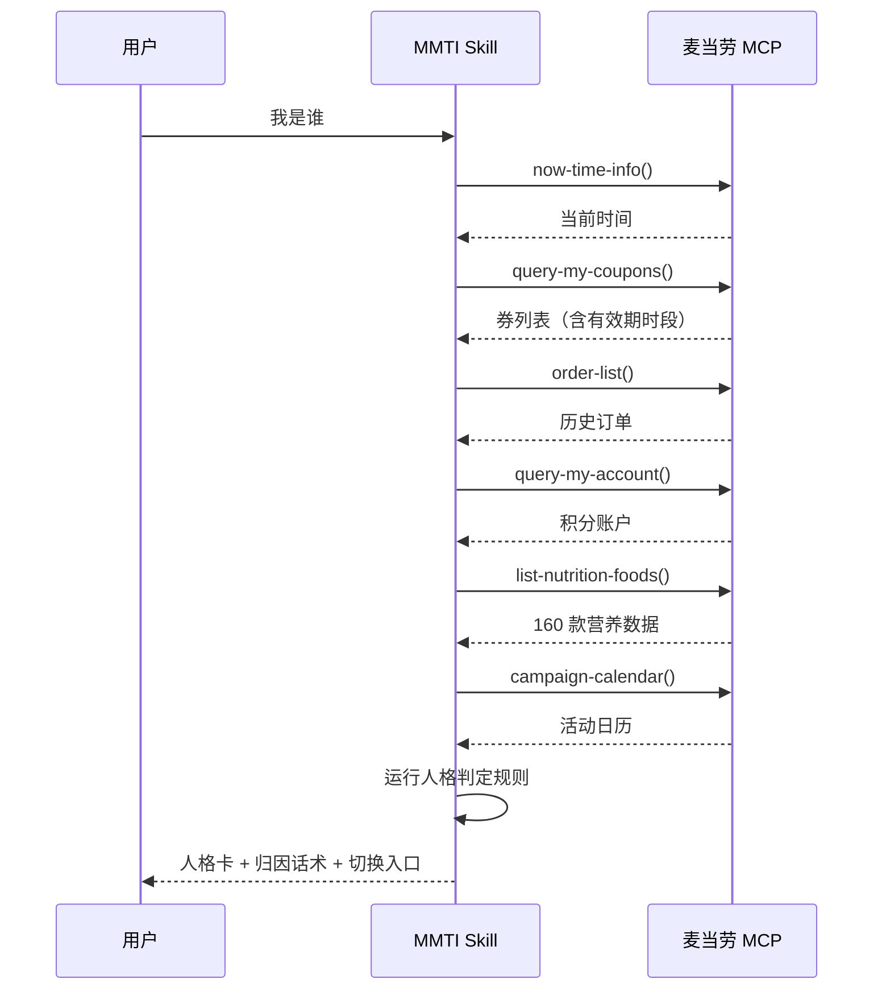
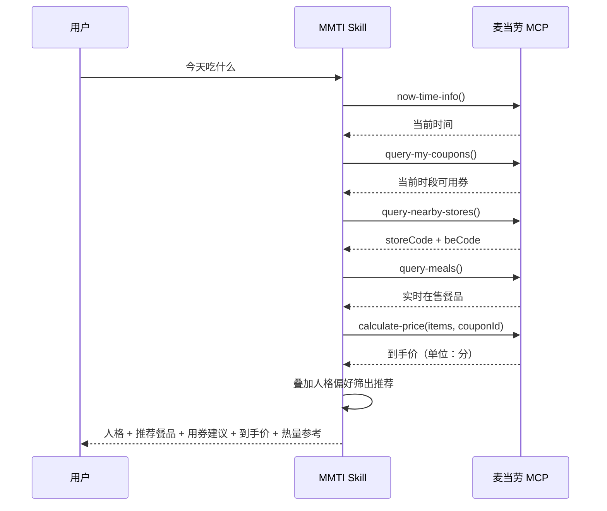

# MCP 集成说明

本文件说明 MCD-MMTI（麦麦人格 MMTI）实际使用的麦当劳 MCP Server、Tool、调用流程与业务价值。

## Server 配置

| 项 | 值 |
| --- | --- |
| Server Name | `mcd-mcp` |
| 协议 | Streamable HTTP |
| Endpoint | `https://mcp.mcd.cn` |
| 认证 | `Authorization: Bearer ${MCD_MCP_TOKEN}` |

> Token 通过环境变量传入，仓库中仅使用占位符，不提交任何真实凭证。

WorkBuddy 用户可在 `~/.workbuddy/mcp.json` 中配置：

```json
{
  "mcpServers": {
    "mcd-mcp": {
      "type": "streamablehttp",
      "url": "https://mcp.mcd.cn",
      "headers": {
        "Authorization": "Bearer ${MCD_MCP_TOKEN}"
      }
    }
  }
}
```

## 实际使用的 Tool

MCD-MMTI 共调用 13 个 Tool，分为三组。

### 第一组：人格判定的数据采集

| Tool |用途 | 对人格的贡献 |
| --- | --- | --- |
| `now-time-info` | 获取服务器当前时间 | 时段轮转的锚点，决定此刻人格 |
| `query-my-coupons` | 用户已持有优惠券 | 判定「券时钟」；有效期决定时段人格 |
| `available-coupons` | 麦麦省可领券 | 补充「券时钟」的未领取提示 |
| `order-list` | 历史订单（非商城） | 判定口味倾向、价格敏感度、复购集中度 |
| `query-my-account` | 积分账户 | 判定「积分守财奴」；计算已过期积分 |

### 第二组：推荐与计价

| Tool | 用途 |
| --- | --- |
| `list-nutrition-foods` | 160 款餐品热量/蛋白质/脂肪/碳水/钠/钙 |
| `query-meals` | 实时在售餐品与价格（支持到店/外送/得来速/团餐四种场景） |
| `calculate-price` | 计算商品到手价，支持叠加优惠券 |
| `query-nearby-stores` / `delivery-query-stores` | 定位门店与 `beCode` |

### 第三组：时效信息补充

| Tool | 用途 |
| --- | --- |
| `campaign-calendar` | 当月营销活动日历 |
| `query-lottery-info` | 积分抽奖活动与奖品池 |
| `mall-points-products` | 积分兑换商品 |

## 调用流程

### 主流程：首次进入生成人格卡



### 副流程：下单前咨询



## Tool 与人格机制的咬合关系

MMTI 的核心创新在于：**人格不是静态标签，而是由真实数据动态生成的。**

### 券有效期 → 决定此刻人格

`query-my-coupons` 返回的券带有精确时段，例如某张 9.9 元早餐券的有效期为「周一至周五 05:00-10:29」，标签为「到店专用」。

该信息直接进入时段轮转判定：

| 时段 | 判定信号 | 输出人格 |
| --- | --- | --- |
| 05:00-10:29 | 存在当日早餐时段有效券 | 满分解 |
| 15:00-17:30 | 有当日到期券 | 券时钟 |
| 22:00 之后 | 无券 + 活动日历有夜宵新品 | 深夜被鼓励 |

即：周一早上 7 点的用户，在物理上不可能被判定为「深夜被鼓励」——这是券的有效期决定的，不是算法主观判断。

### 历史订单 → 判定复购集中度

`order-list` 返回的 `orderProductList` 中 `productCode` 的出现频次，判定「随性真香派」等口味集中型人格。同时 `realTotalAmount` 用于计算均价，支撑价格敏感度判定。

实测样本：连续 3 笔订单均为「精选超值随心配」，实付 13.9 / 13.9 / 18.9 元，横跨 3 个城市的 3 家门店 → 判定为「随性真香派」（脑子型），归因话术「你最近 3 笔订单都是同一个选择，均价 15.6 元，闭眼点就对」。

### 营养成分库 → 支撑身体型人格

`list-nutrition-foods` 返回 160 款餐品的结构化营养数据，支撑「身体型」四个人格的推荐锚点：

| 人格 | 锚点餐品 | 真实数据 |
| --- | --- | --- |
| 平板支撑 | 苹板支撑 Pro | 476 kcal / 蛋白 25 g |
| 零糖战士 | 无糖可口可乐中杯 | 0 kcal / 钠 35 mg |
| 燕麦轻盈派 | 冰燕麦奶铁中杯 | 132 kcal / 蛋白 3 g |
| 蛋白底线 | 纯牛奶（盒装） | 129 kcal / 蛋白 7 g / 钙 231 mg |

### 积分账本 → 驱动积分守财奴

`query-my-account` 返回可用 / 累计 / 已用 / 已过期四项，配合 `query-lottery-info` 的 `drawPoint` 可算出可抽奖次数。

实测样本：可用 56.5 积分，`drawPoint` 为 24，剩余可抽 2 次，奖品池含「板烧三件套 5 折券」。该结果直接转化为「积分守财奴」的行动指令，而非一句空泛的省钱口号。

## 业务价值

### 差异化：解决什么问题

| 现状 | MMTI 的做法 |
| --- | --- |
| 推荐工具回答「买什么最省」 | MMTI 回答「你此刻是谁」 |
| 用户用完即走，无沉淀 | 人格标识建立长期身份认同 |
| 券信息分散在各页面，需用户自己比对时段 | 自动折叠为「今天该几点去、用哪张」 |
| 营养数据仅供查看，与决策脱节 | 营养数据直接决定推荐结果 |

### 数据独占性

MMTI 所依赖的三类数据在公开渠道不可得或不可用：

- `list-nutrition-foods`：160 款餐品的完整营养结构化数据
- `query-my-coupons`：精确到「周几 + 时段 + 到店/外送」的券有效期
- `query-my-account`：含已过期积分字段的完整积分账本

这是本项目区别于通用 AI 点餐能力的基础——**不接入这些数据，人格判定无法成立**。

### 合规约束

依据 `CONTEST_DECLARATION.md`：项目输出仅作为餐品选择参考，不构成医疗或营养诊断。因此 MMTI 中所有热量、钠含量信息一律标注为「信息参考」，身体型人格表达为偏好而非建议。

## 未使用的 Tool

以下 Tool 存在但本项目未使用，原因是场景不匹配：

| Tool | 未使用原因 |
| --- | --- |
| `query-promotions` | 仅企业团餐场景（beType=6）可用，个人用户场景不适用 |
| `create-order` / `cancel-order` | MMTI 定位为决策辅助，下单由用户跳转官方渠道完成 |
| `draw-lottery` | 涉及积分消耗，需用户明确确认后方可调用 |
| `party-*` 系列 | 亲子派对场景，与人格机制无关联 |
| `mall-order-*` | 积分商城为独立链路，不纳入人格判定 |